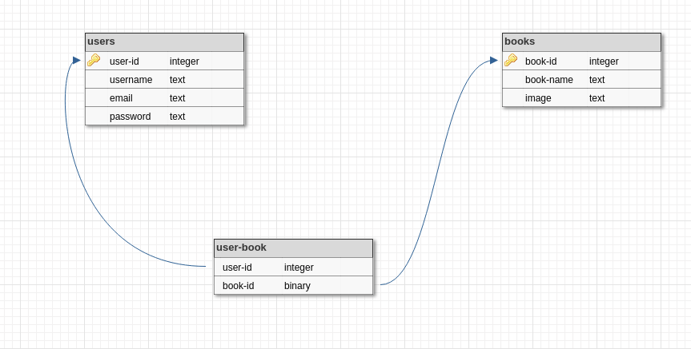

# OurLibrary
Our wibsite displays all books and allows users who registre to add favorite books they're interested in.

## link:
https://libraryappher.herokuapp.com/

## UserStory
### As user:
* I want to sign up in website.
* I want to log in wibsite.
* I want to access the books.
* I want to add my favorite books in the page favorite.

## How to run website locally
* Clone this repository
* Run npm install
* create local PostgreSQL database
* Create a config.env file
* Add DB_URL AND SECRET
* run npm run start (to run the project)

## Database Schema 

## How to run tests
* Run npm install
* run npm test (to run tests)

## Tech stack
* Express.js
* handlebars
* PostgreSQL
* HTML5
* CSS3
* Javascript

